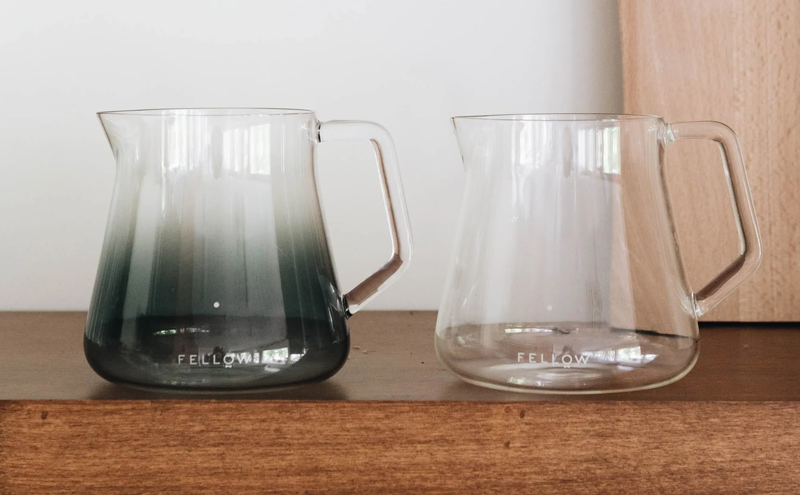

Brewing coffee is more than just a process—it can be a ritual. So, how does the Fellow Mighty Small Glass Carafe elevate that ritual and make it feel even more special?

This article began as a simple review of the Fellow Mighty Small Glass Carafe. After breaking my Hario carafe, I replaced it with a Hario insulated version—perfect for keeping a batch warm for an hour or so, but lacking in the overall experience. That led me to explore why was lacking, from my perspective.

## Fellow Mighty Small Glass Carafe
This glass carafe comes in two versions: a clear hand-blown borosilicate glass or a grey smoked version. 

It holds 620ml of water (you can fit more in it, but then it touches the bottom of the Hario switch base) and has a small white dot to indicate the 300ml mark. The handle is reassuringly solid for a glass carafe, and Fellow says it has a no-drip spout. But its drippiness seems to depend on your pouring style - it's largely drip-free for me, but others claim it isn't as clean for them.

Hand wash only. 

Have to mention it.

Now, I grabbed the smoked glass version, and it might just be the nicest piece of glassware I own or have seen unless we are talking about the flamboyance of Chihuly or Murano island art. 

Let me just labour this point for a second: the smokiness and the graduation of the smoky grey shade through the carafe is stunning. 

It has that look of a 1970s piece - pure style. 

It does have the FELLOW logo low down near the base, and I would probably prefer it without that, but it's not a show-stopper. The only other coffee glassware I like as much are the Kinto CAST AMBER and Sepia vintage ranges.  

I own the <a href="https://amzn.to/3Ol5CGM" target="_blank" rel="noopener">sepia</a> amber coffee cup and wooden saucer - so nice and always cheers me up to drink from a cup quite that orange. 

It's borosilicate glass, and I'm likely to break it one day.  Also have to mention that.

### Why use a carafe at all?
There is something especially pleasant about brewing into a container designed for sharing. 

It is easier to get the coffee down to drinking temperature so it's ready to enjoy, and the carafe also allows me a nice swirl like a fine wine, which adds both visually and aromatically to the experience. 

A ritual can help with mindfulness, social connection, reduce stress, and have health benefits. 

The satisfaction of brewing excellent coffee, using a tried and tested method and equipment that brings joy to the ritual, adds to the benefits. Being able to extend the ritual to others when they visit adds to this experience.

Humans find comfort in the ritual of a thing - be it spiritual or not. Brewing coffee, it seems, is no different. 

So I ask myself, does the carafe improve the ritual?

Those of us who enjoy coffee brewing take great pleasure in setting up our coffee station. Goose neck kettle, scale, drippers, grinder, servers, cups, etc. Like any hobby, the paraphernalia can take over. 

I simplified my set-up after the COVID lockdown. I have a small piece of slate on top of which sits all my non-consumable items. An olive wood stand, scales, three glass V60 cones, a Hario Switch base, Commandante V4 hand grinder, and the Fellow smoked glass carafe. Consumables such as coffee, filters, and water live in cupboards and airtight containers where necessary. 

Only really important pieces now make it onto my coffee station. Brewing and then pouring from a beautiful carafe simply makes for a nicer experience that completes the ritual for me. 

The Fellow Mighty easily made the grade.

Functionally, there are a couple of other things worth noting. I tend to brew using glass V60s (01, 02, or 03) held in a Hario Switch base or with the 02 placed directly in the mouth of the carafe without a holder. The Switch base sits perfectly and seals off the whole mouth and spout. The seal certainly helps manage temperature during brewing as some have complained that the carafe doesn't come with a lid. Don't expect this carafe to keep your coffee hot for long. 

Amazon and others sell small silicone covers to pop over a cup or carafe and I might pick one up someday.

Plastic V60s fit fine, as does my ceramic Melitta dripper. An Aeropress fits well, but I wouldn't personally trust plunging onto the glass carafe. 

I have found only one dripper that doesn't work at all, the olive wood base for the glass Hario V60 range. The spout of the carafe doesn't quite fit between the silicone and the outer edge of the olive wood, leaving the whole thing at a silly angle - annoying as I really like using the olive wood base and now find myself popping the 02 V60 naked on top of the carafe. 

So avoid the Fellow carafe if you use that olive wood base and look at the Kinto carafes instead.

Other than that, I adore this piece of glass, and it makes my coffee brewing experience just that bit nicer every day that I use it. What's not to love? 