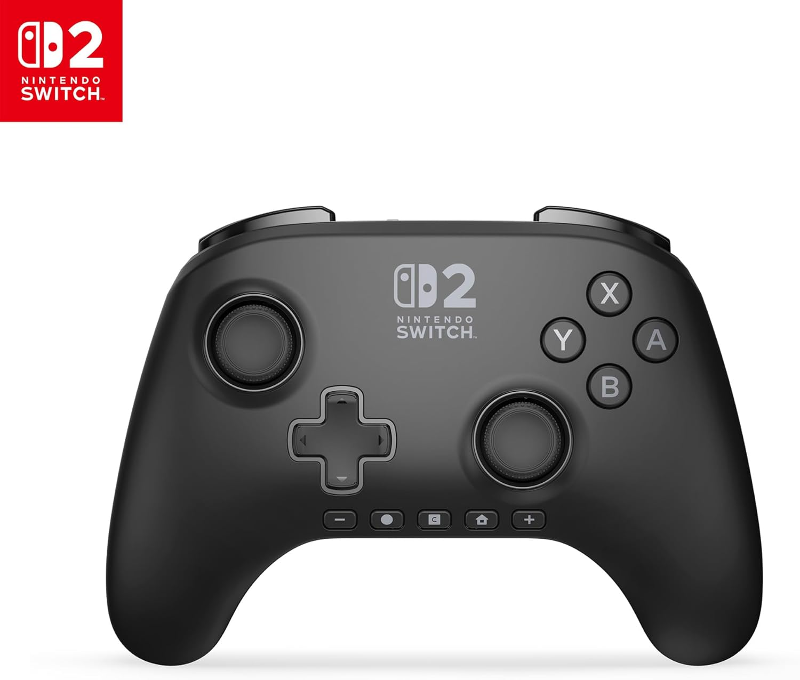
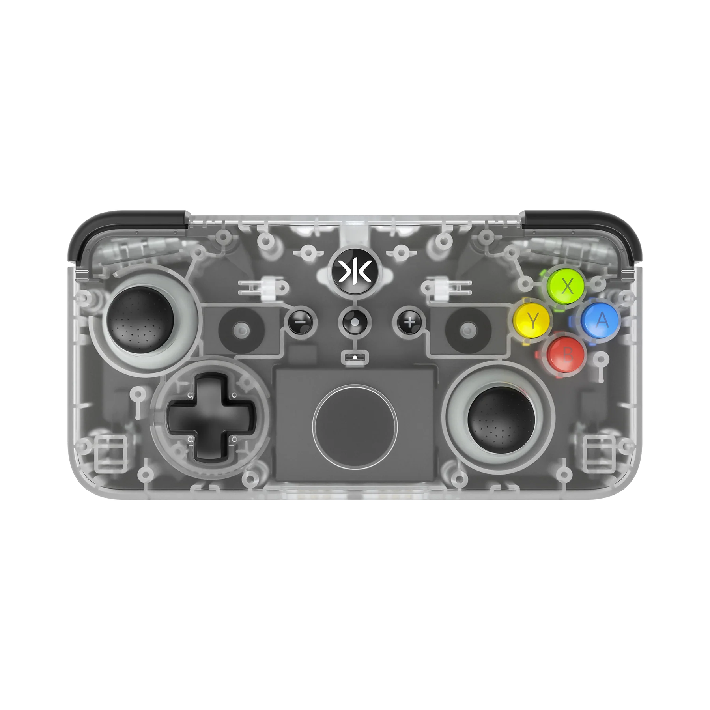

The [Pro 2 Controller from Nintendo](https://amzn.to/4yrfVfn) is held up as one of the best controllers on the market today. So, Pro 2 vs the world.

Well, not against the world. I bought the CRKD Neo S controller for my Apple TV 4K and, by happy coincidence, it works with the Switch.

Then I picked up the Pro 2 controller by Nintendo. But do I regret the purchase, or is the Pro 2 as good as everyone says?

## **Stuff I learned (in no particular order):**

- The Neo is cheaper, but not always enough to make it worthwhile. I paid £28 for the Neo and £59 for the Pro 2, so half price for the Neo is a great deal. At full price, the difference makes for a tricky decision (Neo at £49.99 with stand or £39.99 without, and Pro 2 at £74.99).
- I think both need to be discounted heavily to make them good value. The Neo has 10 classic designs without stands (available separately) at £39.99, and 10 further special editions with charging stands at £49.99.
- The Pro 2 comes in one simple colour, and no special editions have been released at the time of writing. Note that the Pro controller did eventually get a special Link edition.

- The Neo has Hall-effect sticks with removable pads, but the Pro 2 feels more premium and substantial. I had to research Hall-effect. Clever stuff, with magnets maintaining the centring of the sticks and reducing the likelihood of stick drift. Search it if you wanna learn more.
- No lag on either (the Neo had some shocking issues at release, but they were all fixed in firmware a year or more ago), and really responsive buttons. That goes for both controllers.
- Neo build quality is very high, though not quite up to the Pro 2.
- The Neo’s shape and size are both a pro and a con: better for travelling, comes with a bag, and is reasonably comfortable for long play sessions (tested over many hours of Legend of Zelda Breath Of The Wild). While the Pro 2 is more comfortable to hold, I didn’t find as much of a difference as some seem to. I have mid-sized, fairly chunky hands. I find the shoulder buttons to be excellent on both, but the placement is noticeably more comfortable on the Pro 2, as I end up with less of a claw shape. I have noticed some people saying the ABXY buttons could be a little larger. I do like that my Neo design has coloured buttons rather than black ones—helpful when playing with my kids.
- The Neo has great designs, but they’re not to everyone’s taste. I don’t buy into CRKD’s idea that you might collect these controllers (they even sell a wall bracket for them), because they are not that cheap.
- I didn’t bother with the charging dock for the Neo, but it’s a nice feature (for an extra £10) if you want to keep things tidy.
- CRKD is pronounced “cracked”, apparently. Hmm.

- The CRKD app is great for remapping buttons and recalibrating the sticks.
- The Neo can be used with Switch, PC, and iOS/Mac out of the box, and can remember multiple connections. The Pro 2 did connect to iOS but then forgot my Switch, so perhaps it’s not ideal for multi-system gaming. Actually, both are a pain to switch between different systems.
- Both are great wired controllers. Both can play and charge at the same time. I had to connect both to my Switch 2 by wire to get them to connect. Might be my settings.
- Battery life is bonkers on both. Quick charging and the ability to play while charging make battery life something you don’t have to worry about. A note about Nintendo: they have announced they will be upgrading the Pro 2 to have a removable battery for the EU market from winter 2026/27.
- The Neo S has a tendency to need occasional re-pairing with the Switch 2. Sometimes I even have to connect it by USB to get it to register. The Pro 2 never has this issue. This is almost enough on its own to recommend the Pro 2 over the Neo.

## **My Summary**

**Nintendo Pro 2 Controller** – The best controller I have ever used. Never uncomfortable, feels premium in every way, analogue controls feel silky smooth and ultra-responsive, and it has all the Nintendo first-party extras: amiibo support, a headphone jack, extra programmable buttons, and on/off power control for the Switch 2. Superb.

**CRKD Neo S** – Great for the money. Perfect for travelling. No regrets at £28. An ideal second/third controller.

[Buy the Pro 2 from Amazon to help support my site.](https://amzn.to/4fbE3uL)

[Buy the Neo S from Amazon to help support my site. ](https://amzn.to/44FnaT6)
