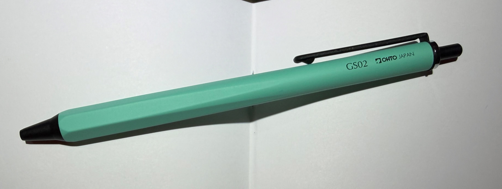
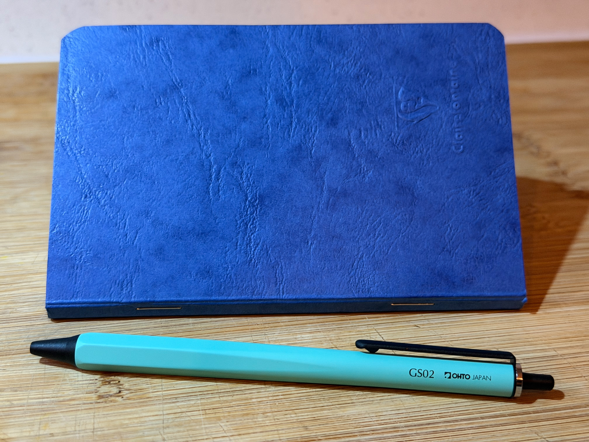

I have owned pens, some fairly typical and a some from less usual pen manufactures, since I was able to write. As a kid I had a Parker or three, a Lamy, Waterman, and a Sheaffer. They were always ballpoint or fountain, and I rarely enjoyed writing with them. There were also a dozen cheaper, and leakier, pens whose memory disappeared more quickly than the ink stains ever did.

Throughout my university years straight after I used pretty much any cheap pen I could find - BIC seemed to feature heavily - as I lost a fair few in classrooms. Owning a nice pen as a teacher was not high up on my agenda.

Leaving teaching I grabbed a cross ATX chrome. A pen that taught me about gel ink and managed to combine the elegance of a fountain pen with the convenience of a ball pen. But it is smooth to write with. I still have my Cross and it is a lovely pen to use when I'm sitting at my desk.

Fast forward twenty years and I have gone through dozens of cheap pens and a few nicer ones. At some point I read John Gruber mention the Zebra Sarasa but it took me years to be able to source these in the UK. For the last 10 years I have been writing with Sarasa 0.7mm vintage rather than John's favoured 0.4mm. Although I have a different preference in tip, I couldn't agree more about the quality of the pen.

For work, and general scratchings the Sarasa is tough, cheap (£1.25 or so) and smooth as butter. The ink lasts a surprisingly long time for a 0.7mm gel. The ink dries quickly and I have never had any smearing. Bleeding can be an issue if you use thin or porous paper but anything upwards of 70gsm seems to be lovely (Moleskine is ok, Clairefontaine is better) - a very forgiving pen.

The funny thing about the Sarasa is that I cannot buy refills cheaper than the whole pen and there is a part of me that is unhappy about the plastic waste I'm helping to create. I spent some time trying to find a metal body I liked that holds the Sarasa refills but there isn't much past the companies own Sarasa Grand series. There are several reasons I don't particularly like the pen body; width, lack of taper, general feel.

I also wanted an inexpensive body that would be replaceable if I lost it, lightweight, slim, with a clip for my notebook and tough for travel or throwing into my bag. I was looking for a workhorse.

The Ohto pens kept coming up in my searches - but the GS02 stood out particularly. An aluminium anodised/coated body available in a cool mint colour, and a superb barrel that tapers from round to hexagonal - why don't more pens try this shape, so comfortable. Finally, the ink - the 0.5mm ceramic gel is fantastic. As smooth as the Sarasa, keeps my handwriting a little more under control owing to the smaller nib size (but I could always go for a smaller Sarasa). And, at £20 for the pen with the refills working out between £6 and £8, I couldn't be happier with the price of the pen but the refills are a little on the pricey side.

The **OHTO GS02** in mint is an excellent pen: slim, aluminium-bodied, understated except for that mint colour, and engineered with a restrained Japanese design language. It looks like a technical instrument rather than a disposable office pen, and paired with the **PG-M05NP 0.5 mm ceramic gel refill** it becomes an enjoyable everyday writing tool.

As I have already mentioned, I normally write with **Zebra Sarasa Clip (Vintage) gel pens, which are one of the best cheap gel pens available. They are smooth, dark, widely available, and the refills cost very little. That makes them a good benchmark when judging any refillable pen system. The GS02 sits in a different ecosystem - the Parker-style G2 refill format** - so it becomes a compromise between aesthetics, refill choice, and writing feel.

One note to consider, the GS02 takes the [**Ceramic Roller Gel PG-M05NP**](https://amzn.to/4745ja9) refills, as mentioned, but they can be a little hard to find in the U.K. Amazon seems to sell packs of five from time to time.

## Design and ergonomics

The first thing the GS02 gets right is proportion. It’s slim and light without feeling flimsy. The aluminium body keeps the weight low, which makes it comfortable for long writing sessions - closer to a technical drafting pen than a chonky executive pen.

The mint colour is actually a matte turquoise. The hexagonal grip is perfect: enough texture and shape for control but no aggressive knurling. It’s the sort of grip you forget about while writing.

Compared with plastic gel pens like the Sarasa, the GS02 simply feels more deliberate. And not just because it's not a disposable pen. There is something rather more premium than its price would suggest.

I have only thrown the pen in my bag for about a month now and there's no damage or scratches. But I think a little scuffing will add to the character over time. I write in a mixture of Moleskine cahir journals and Clairefontaine notebooks. Whilst the Clairefontaine paper is obviously superior, it is a pleasure writing on most paper - a very forgiving ink.

I haven't come close to finishing the first ink refill but I was intrigued but the name 'ceramic gel', so I did a little research and compared Sarasa gel to Ohto ceramic.

## The refill: OHTO PG-M05NP

The **PG-M05NP** is a Parker-style gel refill with a **0.5 mm ceramic ball needle tip**. OHTO’s design uses a silicon-carbide ceramic ball, which is extremely hard and resistant to wear. The refill is designed to write smoothly at shallow angles and to dry quickly on the page. I have a cursive style of writing and need a pen that can work at these angles, perhaps why I generally like gel pens.

OHTO also claims a writing distance of **around 700 m**, which is not bad for a gel refill.

In practice the refill behaves like a **fine, controlled gel roller** rather than a wet gel pen.

## Writing feel compared with Zebra Sarasa

If you are used to a **Sarasa 0.5 or 0.7**, the difference is noticeable immediately.

The Sarasa is the more luxurious writer in pure smoothness. It glides across the page with almost no resistance. The OHTO refill, by contrast, feels **precise rather than plush**. There is much more feedback, making handwriting tighter and easier to control.

In short:

- Sarasa is **smooth and expressive**
- Ohto refill is **clean and precise**

For quick notes or my work scribbles the Sarasa probably wins. For more thoughtful writing, diagrams, and neatening my handwriting, the Ohto is my choice.

## What the GS02 refill actually is

The refill used in the GS02 is the **OHTO PG-M05NP “ceramic roller gel” refill**. It contains **water-based gel ink** and uses a **0.5 mm ceramic ball tip**.

Key technical points:

- \*\*Ink type:\*\* water-based gel
- \*\*Ball material:\*\* silicon-carbide ceramic
- \*\*Tip type:\*\* needle point
- \*\*Ink reservoir:\*\* metal Parker-style refill body
- \*\*Estimated writing distance:\*\* \~700 m

The ceramic ball is extremely hard (almost diamond-like hardness), corrosion-resistant, and maintains its shape over time, which helps keep the ink flow stable.

So from an ink chemistry standpoint, **it is a gel pen**.

## Why it feels different from a Sarasa

Even though both use gel ink, they behave quite differently.

### Zebra Sarasa

Typical properties:

- Low viscosity gel
- Metal ball tip (usually tungsten carbide)
- High ink flow
- Plastic refill reservoir

Effect on writing:

- Very smooth glide
- Thick, saturated line
- “Juicy” feel
- Ink dries moderately quickly

The Sarasa is all about **smoothness and colour saturation**, which is why it’s great for everyday writing and journaling.

### OHTO ceramic roller gel

The OHTO refill is engineered differently.

Main differences:

### **1. Ceramic ball instead of tungsten carbide**

The ceramic ball has microscopic surface texture that helps retain small amounts of gel ink while rotating. This provides steadier ink release and a more controlled line. Most gel refills favour the tungsten carbide ball.

### **2. Lower ink flow**

The OHTO refill is designed to **lay down less ink** than many Japanese gel pens. This delivers more feedback and better performance across a wide range of paper types.

### **3. Needle-point tip geometry**

Sarasa pens use **conical tips**, while the Ohto refill uses a **needle tip**. Ohto gains precision.

### **4. Parker-style refill constraints**

Because it fits the **Parker G2 refill format**, the ink reservoir is smaller than the long plastic refills used in Sarasa/EnerGel. The Parker G2 makes for a strong, travel friendly package that manages controlled flow and something like 700m of ink. Based on research, this is ok for a gel pen.

What Ohto has done is optimise the Parker format as much as possible:

- ceramic ball for consistent ink transfer
- needle tip for precision
- controlled gel formulation

## In summary

I won't stop using the Sarasa vintage range any time soon, but for travel and spending time enjoying my writing, the Ohto will be my go-to from now on. And the Cross ATX is to be saved for writing very occasional letters.

Grab the OHTO GS02 pen from Amazon [here](https://amzn.to/47j7ZAO).
