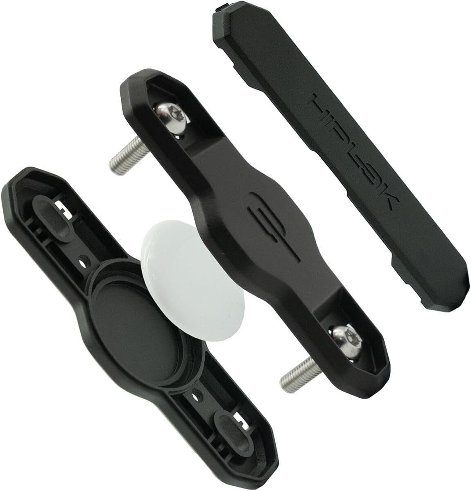
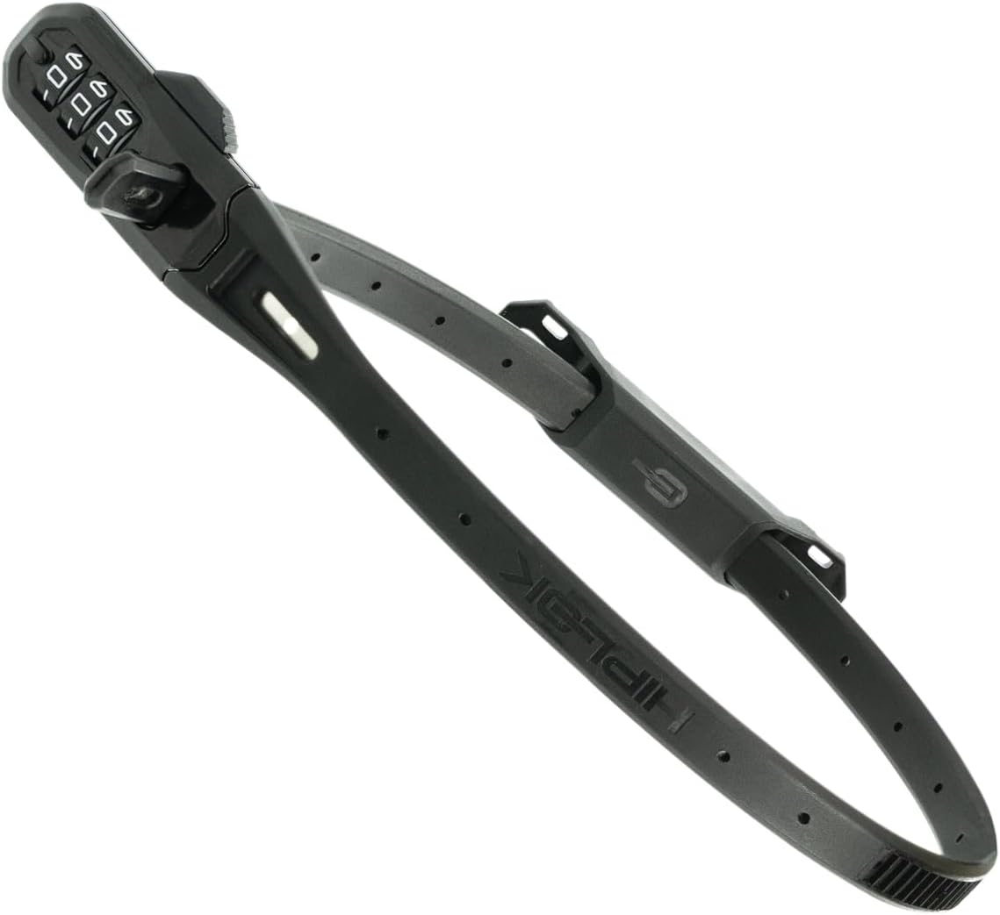

Finding a good lock for my bikes and my kids' bikes has been difficult. And each situation has different reasons for it being challenging.

On my older boy's bike we need something lightweight and easy to use; quick to put on but security is of secondary importance. His wheels stay outside his classroom within a locked school. It's for a 20-inch bike and most locks simply will not fit a 6 year old's bike.

For my own bike I need something to supplement my real d-lock, help secure the removable wheels or perhaps lock my kids' bikes to mine if we are leaving the bikes for just a few minutes in a location we can still keep an eye on.

Enter Hiplok. A UK based company started in 2009 who try to solve the problem of carrying heavy, bulky locks by designing comfortable, wearable security solutions.

I knew of Hiplok from years ago when I had one of their original wearable locks. It was great until it got damaged when someone had a go at it outside a pub and I ended up replacing it with a different d-lock.

Searching Amazon I came across the Hiplok Airtag holder - officially called the 'Track'  and available for around £17.

Excuse the product shots:

But before I pressed buy, I noticed that it had a Z-Lok adapter on it. So, searching for Z-Lok came up with keyed or combination versions (between £10 and £25) of a simple cable lock (that can be attached to the Airtag holder).

I grabbed two Z-Loks and two Airtag holders.

These things are great for convenience and for locking a helmet to your bike or for the bike in a fairly secure area. I wouldn't trust one to last more than 10 seconds against a planned attack from a thief with a hacksaw, but to stop an opportunist: on a train, or where you can see it, then these little locks are perfect.

This lock is ideally suited to parents or those who need a lightweight lock for quick pit-stops.

As for the Airtag holder. Even better. A weatherproof holder that's extremely discrete and can hold your secondary lock. It's made of plastic and holds your Airtag away from the metal frame so the signal strength is not noticeably affected in my testing of a naked Airtag next to the one sealed in the holder (both were 1st generation).

The bikes have been caught in some pretty heavy downpours and the Airtags have not been harmed.

This is a nearly perfect combination for my needs. I recommend this lock. I just wish there was a way to fit this solution onto a Brompton folding bike (not G line) as it would save me from having to carry around a different cable lock in a saddle bag. Brompton bikes don't leave many options for connecting accessories owing to their very clever folding system and lack of standard attachment points. If you have come across any really good 'cafe' lock solutions for Brompton, reach out via social media as I'm always trying to find a better solution.

If you want to check current prices and buy from Amazon, use my affiliate links below:

[Hiplok Airtag Holder](https://amzn.to/46Rq9cq)

[HIplok Z-Lok Combination lock](https://amzn.to/469Cuso)
