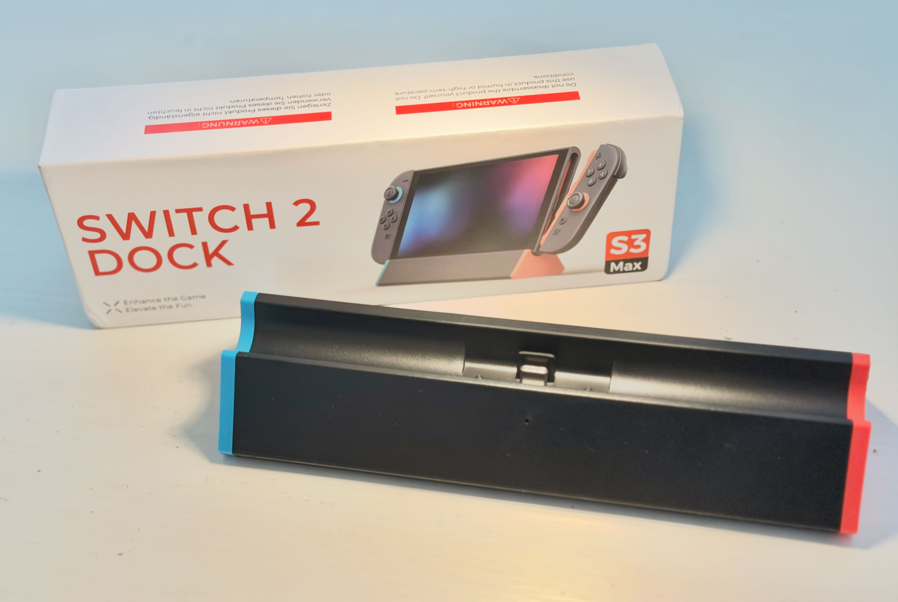
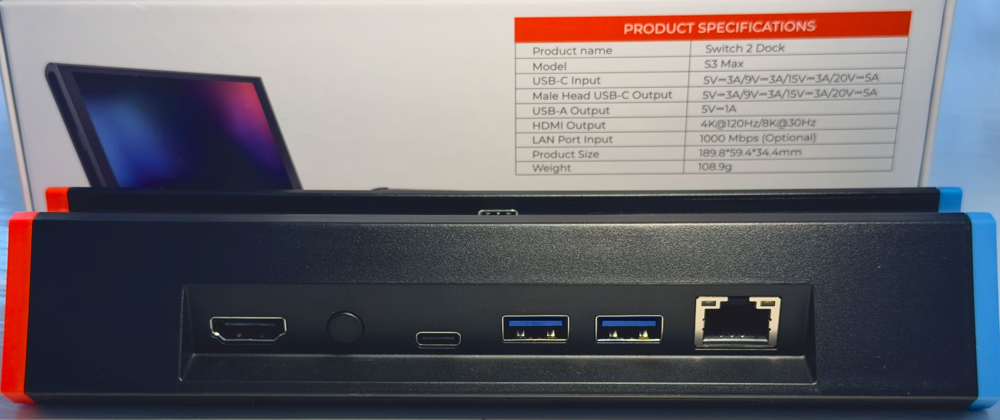

I wanted a second dock for my Switch 2 when travelling and to use with a monitor in my office. 

**NOTE: this review has been updated since the 23.0.0 firmware Switch 2 update was released on the 9th September 2026.**

The S3 Max + LAN sold by Antank for £28 at the time of writing (discounted from £35 and bought with my own money) fitted the bill.

Alternatives I discounted included: Nintendo's official dock and charger for £90. A range of Amazon specials ranging from £11 to £30 but many of which had reports of not working when Nintendo updated firmware and finally the Genki travel dock. The Genki looks amazing but it is £70 and currently completely out of stock. 

The S3 is a great little dock / stand with the following features:

- HDMI output
- USB-C charger input (no power supply included)
- Two USB-A for charging only
- LAN port (optional for £3)
- A switch to change output between HDMI or NS2 screen (just a stand with charging and LAN)
- rubber feet on the bottom to make the whole thing non-slip. Have to say it still slips on my work desk but that's not a major issue.

Excuse the rough and ready product shot:

Importantly, it comes with a printed card to help users manage [firmware updates ](https://antank.net/pages/s3-max-firmware-update?srsltid=AU7gw4XvnKcsB8sDV0fjf-yJx8-geurbUSUDAC7q1vxEtW1wx0NLC7bN)should Nintendo make changes and try to block the use of third-party accessories. Really cool.

**EXTRA NOTE ON FIRMWARE UPDATES...**

The instructions strongly suggest using a Windows PC to carry out the updates owing to the technical nature of the Mac updates. Mac requires terminal work and placing the folder specifically on your desktop despite the instructions not being clear about this. The big issue with the Mac version is it requires a second audio/video USB-C cable with a female socket on one end. This is a cable I don't have. The instructions ask that both cables are used to connect the dock to the Mac. At this time I have not been able to test this feature and strongly suggest that only PC users grab this dock until the company simplifies the Mac process. I reached out to Antank and here is the reply verbatim:

> _For the male-to-female USB‑C adapter required for Mac firmware updates, please select a full‑function model that supports audio and video signal transmission._

> _Our product team is following up on this feature, but we are unable to simplify the process at this stage. Should we release any improved update tools or simplified instructions in the future, all information will be posted on our official website promptly._

So, how does the dock work.

Despite being behind on firmware, the dock continues to work though I had to remove the Switch 2, unplug all cables and then plug in the power (USB-C) and check for the little blue indicator light, then plug in HDMI, and then reattach the Switch 2. Until I unplugged everything and started with power, there was no sign of life. 

So, in theory, grab your Switch 2 sans case and plonk it on the stand (after you have already connected your power/HDMI in the right order). There are no fans or holes at the bottom but the gap and the fact that there is no other enclosure around the console means the Switch 2 didn't get any hotter in use than docked in the official Nintendo unit. In fact, when I pointed a heat radar gun at it the Switch 2 was slightly cooler using the S3 after an hour compared to the Nintendo dock. By 2 degrees. My heat gun might not even be accurate enough to worry about the difference to be fair. 

Other than that, the HDMI output works perfectly, sound carries through and auto input change worked on my monitor so it's doing all the things you would expect in 2026. 

The switch on the back allows you to switch the dock's HDMI output on and off. That switches between a simple stand / charger and a fully operational dock. It works and saves you having to pull out the HDMI cable (very stiff on my dock).

The USB-A sockets charge only so there is no connecting cameras or equipment to the dock. Fine for me, but might be a bit annoying if you need to connect a controller that has run out of power or is refusing to pair. You yust have to use the USB-C socket on the top of the console to direct connect accessories. 

The LAN port also just works. Not that I have any intention of using when I'm home. The real reason I grabbed the LAN version is because hotels and family homes can be a bit funny about WiFi access. Kids arrive somewhere and try to obtain the password from Grandma. The password will either still be on the bottom of the router, or lost to time itself. Take an ethernet cable with them, plug it in, and hope we are near the TV. I was also thinking of times I have been in a hotel and could plug straight into a travel router using a cable liberated from the room TV. For £3 it seemed like a good safety-net.

You can see the ports are well spaced:

The red and blue shoulder colours are a bit toy-like but the black has a nice matte look to it that almost matches the Switch. The red and blue match the controller colours so I guess you don't plug the Switch 2 in the wrong way in a dimly lit lounge.

The dock is a bit hollow and made of thin plastic, not sure sure if I should complain about that for £28. Just something to be aware of. As a positive, this is very light to travel with as it weighs just over 100g. 

In summary

It's a dock. It outputs HDMI and charges my Switch 2. It didn't cost the earth. If you are a Mac user and value firmware updates I cannot recommend this product at this time.

Thanks for reading.

Consider buying something from my [affiliate link](https://link.amazon/B0iuqI3D9) to support this site.
