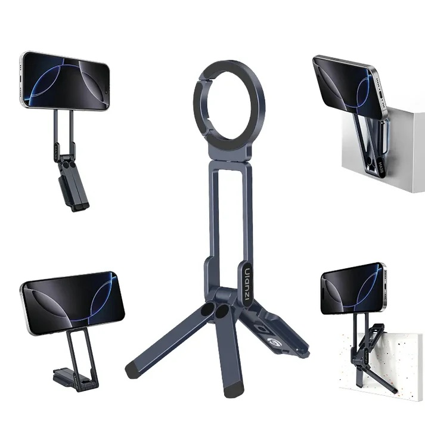
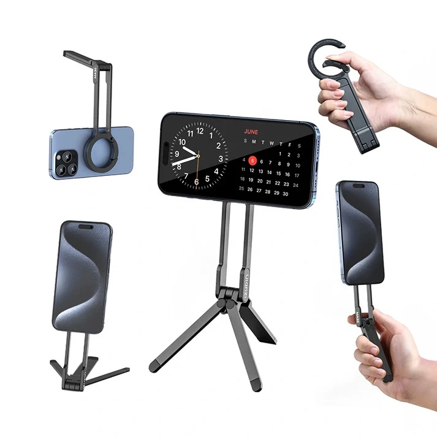

## The gap in my every day carry

With a holiday coming up for the family I decided I wanted a small tripod, something compact that can clip to the back of a plane seat. It should also serve double duty with the kids watching an occasional video and be generally useful for the family.

## **Options**

I hadn’t come across Ulanzi before starting my research. The brand looked ideal when I asked Google for photography companies with similar quality to Peak Design. The MA30 and MA38 came up as ideal candidates. Although there are lots of companies selling similar carabiner style tripods, it took only a few minutes of searching to find out that Ulanzi where the first company to bring this high quality product to market.

It was also quick to find that Ulanzi is a highly respected budget photography company.  There design, along with the price, quickly knocked other options like the Peak Design Mobile Tripod or a Joby Gorillapod with phone attachment out of the running.

Initially I was going to go for the cheaper Ulanzi MA30 but the ability to stick the MA38 to things magnetically, attach it to a tripod and utilise ‘mantis mode’ just made the MA38 the better choice.

## Specs:  

### MA38 features

- Material: Aluminum Alloy + Magnet
- Max Load: 450g
- Folded Size: 155mm
- Weight: 108g

### MA38 Modes

1. Phone stand, various heights and angles
2. Handheld mode, a short selfie stick
3. Tripod mode - a small leg tripod and reasonably stable
4. Magnetic / snap mode - use the magnetic base to attach to anything magnetic
5. Mantis - use the built in hook to suspend it from thin structures like the top of a TV, phone tray etc.
6. Quick release Arca tripod connector and standard 1/4” female thread connector for attaching to tripods.
7. Carabiner to connect to a bag or strap for carrying
8. Magnetic Maglock connector for phones - very strong magnet and a weaker magnet on the reverse of the head allowing other Maglock devices to be attached.
9. 360 degree rotating head

Excuse the use of the official product shot:

### **MA30 features**

Like the MA38 but without the Arca / threaded tripod connector, magnetic base, and without Mantis hook mode.

And again, excuse the product shot:

## **A comparison of the MA38 and MA30**

The MA30 is definitely a little lighter and the swivel system that puts it into handheld or tripod mode is a little simpler because it doesn’t have the Arca mount. Because of this the phone tripod also has cleaner lines and not quite as much bulk caused by that magnetic base.

On the flip side, the MA38 feels a little sturdier in phone stand mode popped on a desk. In tripod mode performance is identical and clipped to a bag, you simply don’t notice the difference in size and weight.

So, it came down to additional functionality and the three extra connections that come with he MA38. I had to decide if the extra £5 (at time of testing the MA38 was £31) was worth it.

In short, the MA30 prioritises simplicity and weight, where the MA38 provides you with the extra magnetic base, tripod compatibility and the interesting mantis mode.

## **Real-world testing**

The magnetic base is strong. Enough to hold an iPhone 17 and give me confidence the whole unit wasn’t going to fall off. I stuck it to my cooker extractor unit as if I were filming cooking on my hob or the counter in my prep area. Although I’m not sure I’ll be creating such content, I was confident it would work brilliantly for that purpose. The magnet stuck and held to a few other things I tried like my fridge, an iron railing and a bike shed. The flatter the stronger the connection but I was impressed how it stuck to all those items. Score one for the MA38.

Next up was the tripod connector. I found out my tripod doesn’t have an Arca connector. It nearly fits but not quite. Obviously I need different tripod that supports this standard. So I grabbed the quick release tripod plate, screwed it into the phone mount and connected it up. Simple and easy. A feature I won’t use a huge amount but nice all the same. The MA30 is certainly more svelte for removing the Arca connector, thread and magnet and so I’ll call that a draw.

Finally, there is another hidden piece in that magnetic Arca base, the mantis hook. With a finger nail you flip up a small piece of metal with a lip on it and that, along with two of the tripod feet, provides you with a way to hang your phone mount from all kinds of things. It is worth noting that the thing ideally is a narrow ledge rather than a shelf so there is something for the mantis system to grab onto. But other than that limitation, it’s great. There is another style of mount that can grab onto shelves but that adds too much bulk for my liking. The mantis hung off the back of a chair, the fence in the playground and a wall with a tile topper near the beach. This is a very cool feature and another win for the MA38.

I have already described a few places I tested the mount but I’ll share my first real uses.

As a tripod my kids wanted to try stop-motion photography. The phone mounted very firmly magnetically and the range in height allowed us to find the perfect position and angle for the shot. The phone stand worked better than this for the stop motion because I could hold the base to steady it as my kids were taking shots. Next time I will attach it to a full tripod and use a remote shutter. Both as a quick test and an ideal set-up this phone stand was superb.

Next up I popped the phone and mount on the beach in tripod mode. The hinges are really firm to move, the stand holds the position without a wiggle and the tripod steadied the phone on the shingle beach as well as any I have used. The little rubber feet provided extra grip and the little bits of sand brushed off the high quality aluminium easily.

I tried the tripod mode in a number of places including the skate park, padel court and a climbing centre. It works just as well everywhere I tried it and on lots of different surfaces.

Finally I tried mantis mode. Being able to hang it on a tennis fence and high up on my window shutters at home just added a huge amount of versatility. Using the 360 magnetic head and the adjustable arm meant I could angle it to see any part of the court or room that I wanted. The phone stayed pointing in the direction I set it without movement.

## **Downsides**

The only negative I found was that the magnet is so strong it marks the back of my phone case and leaves a clear ring. I’m not sure if this is a manufacturing oil left on the rubbery silicone on the magnetic side or something else. The mark seems to disappear from my case once I give it a good clean/rub like the pattern on a carpet does when you rub your hand against the pile.

Although I had originally wanted something a touch smaller the extra size is negated by the additional functionality and the carabiner clip that means the tripod doesn't need to take up space inside my bag or coat pocket as that clip is so versatile.

I also ended up buying a bluetooth remote camera shutter button so I can use the selfie stick mode properly. Not a downside, but something to consider. 

## **Verdict**

I strongly recommend this tipod. If you are looking for a jack of all trades then this might just fit the bill. I have a much smaller magnetic stand that is so small I can leave on the back of the phone in my pocket and I hardly notice. This is for all those times when I need a substantial stand, a flexible stand, and one that can direct my phone with confidence. The internet seems to agree with me because there are so many similarly designed stands with less than glowing reviews all over the place. Stick to the original. Ulanzi has great reviews as a serious if budget photography company.

Support the site by buying from Amazon

- [MA38 Maglock carabiner Phone Tripod with mantis mode](https://amzn.to/4tzqSsH)
- [MA30 Maglock carabiner tripod](https://amzn.to/46410uS)
- [Bluetooth camera remote shutter button](https://amzn.to/3MHssYQ)
